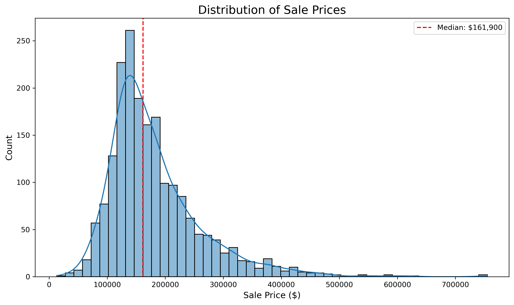
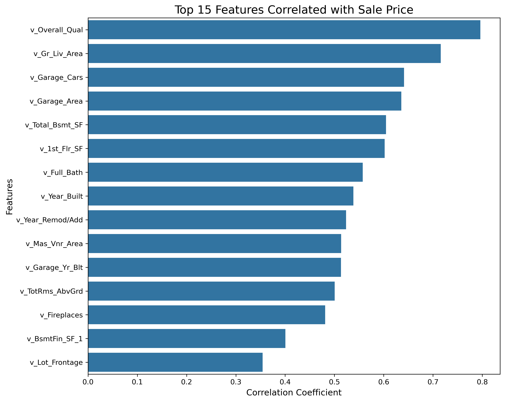
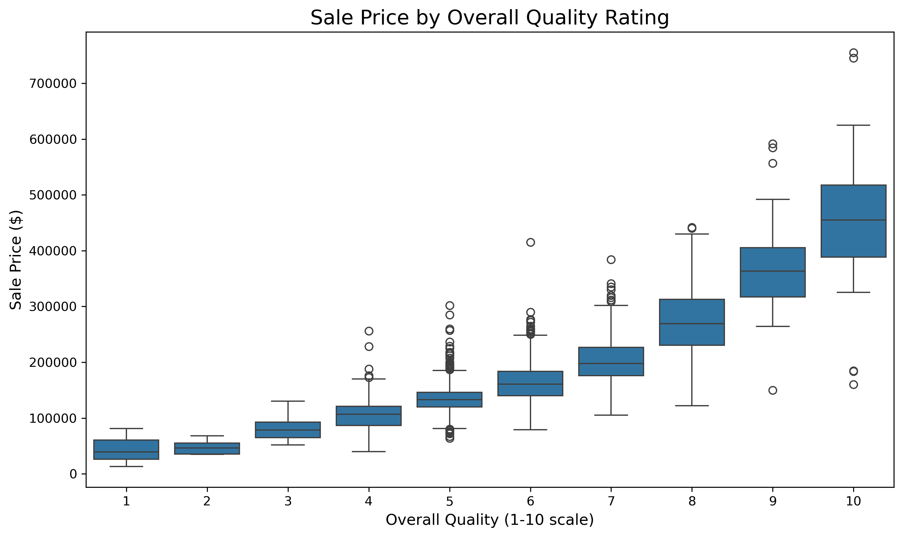

# Housing Price Prediction: Regression Analysis & Model Comparison



## Project Overview
This repository analyzes residential property sales data (2006-2008) to identify key determinants of housing prices. Through exploratory data analysis and regression modeling, we:

1. Evaluate different functional forms for price prediction
2. Compare time-based vs. structural feature models
3. Develop a high-performance prediction model (R² = 0.828)

**Key Insights**: 
- Structural features (quality, size) dominate temporal effects
- Log-log specifications best capture non-linear relationships
- Year fixed effects have minimal predictive power

## Data Inputs
- Primary dataset: `housing_train.csv` (1,941 sales records)
- 80+ features including:
  - Structural: Lot area, living space, quality ratings
  - Temporal: Year built, year sold
  - Location: Neighborhood, zoning
- Target variable: `v_SalePrice` ($13,100 - $755,000 range)

## Key Visualizations

*Top predictors of sale price*


*Price premium by quality rating*

## Installation & Requirements *
```bash
pip install pandas
pip install numpy
pip install statsmodels
pip install matplotlib
pip install seaborn
```
*Make sure to download the summary_colFE.py file
