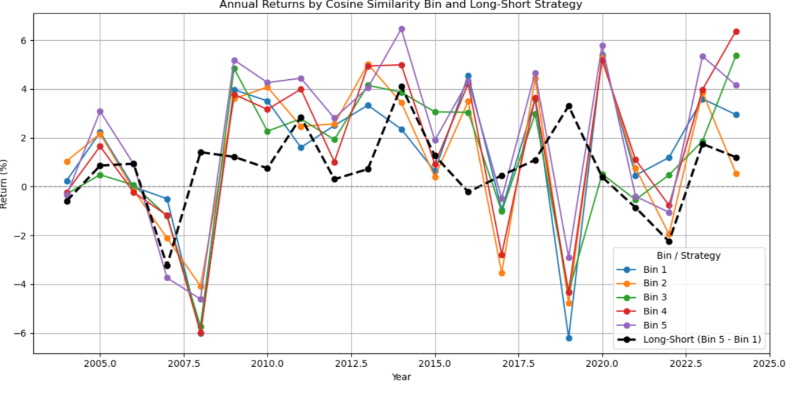
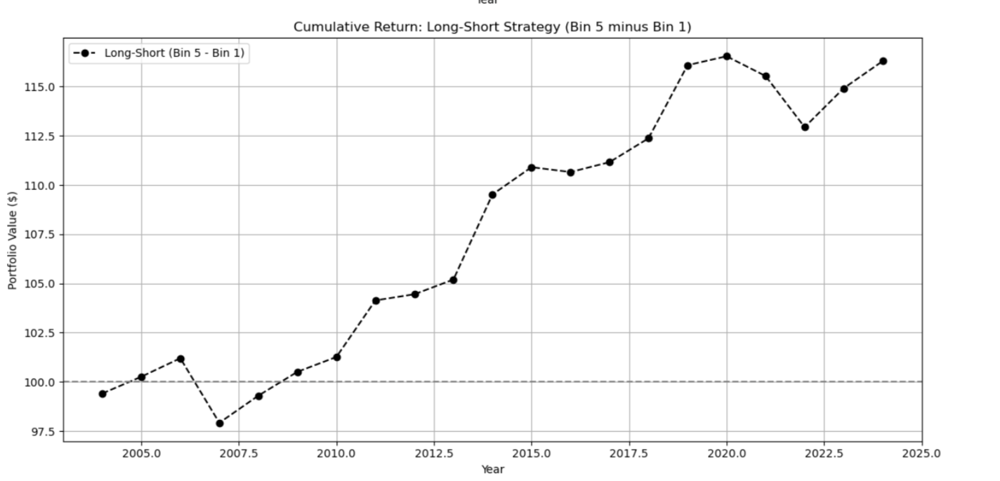
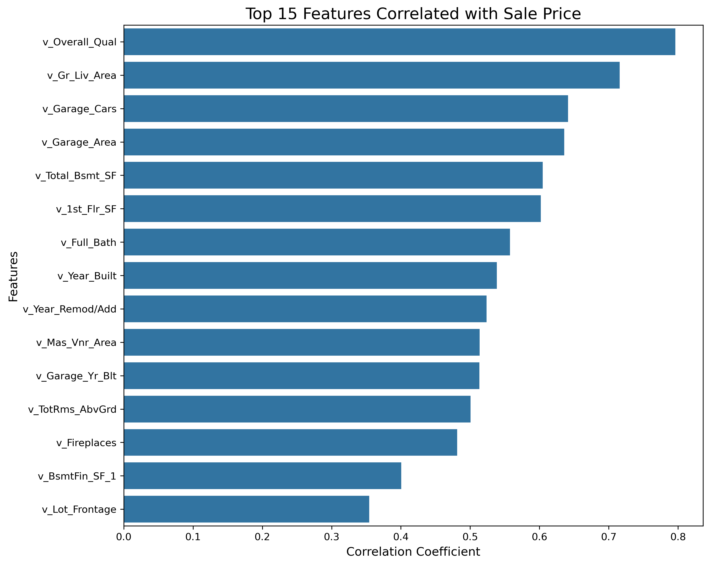

## About Me

I am a senior at Lehigh University, pursuing a dual Bachelor of Science degree in **Chemical Engineering** and **Integrated Business and Engineering (IBE) Finance**, with a minor in **Economics**. I am part of the competitive [IBE Honors Program](https://ibe.lehigh.edu/welcome-lehighs-ibe-honors-program), where I apply a multidisciplinary approach to solving complex engineering and financial challenges.

  

---

## Portfolio

Here are a few of my academic and personal projects that reflect my interests in data science, finance, and engineering:

### [Lazy Prices Project](https://lazypricesproject.streamlit.app/)

This project replicates and extends the findings of the [Lazy Prices](https://papers.ssrn.com/sol3/papers.cfm?abstract_id=1658471) paper, which argues that financial markets underreact to subtle but informative language changes in 10-K filings. Using a comprehensive dataset of S&P 500 firms from 1993–2024, we implemented an end-to-end NLP pipeline to quantify textual similarity in annual filings and examine its relationship with stock returns.

We used the Loughran-McDonald 10-K dictionary to extract word frequencies, computed cosine similarity between consecutive years' filings, and merged these similarity measures with return data. Firms were ranked annually into five bins based on filing similarity—ranging from high-change (Bin 1) to low-change (Bin 5).

**Key Finding:** Firms with the most consistent disclosures (Bin 5) exhibited the highest long-term returns, supporting the idea that stability in language reflects lower perceived risk. Contrary to some expectations, firms with moderate or even low similarity still occasionally outperformed, suggesting the relationship is nuanced and not strictly linear.

**Visual Results**

    <strong>Annual Returns by Cosine Similarity Bin and Long-Short Strategy</strong> 
   

 

    <strong>Cumulative Return: Long-Short Strategy (Bin 5 minus Bin 1)</strong> 
  

---

### [Natural Language Processing on 10-Ks: Identifying Risk](report)

Applied NLP techniques to SEC 10-K filings to extract sentiment and identify risk-related language. Combined textual analysis with financial return data for empirical validation.

  

---

### [Regression Interpretation](A6readme)

This project investigates residential housing prices through a combination of exploratory analysis and regression modeling. We analyzed over 80 variables from 1,941 home sales (2006–2008) to identify key price drivers. Strong predictive performance (R² = 0.828) was achieved by emphasizing **structural features**—such as overall quality and living area—over time-based variables.

Two core visualizations reinforce the insights:

- **Quality Impact:** Homes with higher overall quality ratings command substantial price premiums.
- **Feature Correlation:** Variables like `v_Overall_Qual`, `v_Gr_Liv_Area`, and `v_Garage_Cars` show the strongest linear relationship with sale price.

Our findings highlight the effectiveness of log-log regression specifications in capturing non-linear relationships in housing market data.

#### 🔍 Visualizations

**Sale Price by Overall Quality Rating**  

**Top 15 Features Correlated with Sale Price**  

---

### [Personal Presentation Sample](/pdf/sample_presentation.pdf)

A sample of my communication work from an interdisciplinary seminar, highlighting how I present complex ideas to diverse audiences.

---

## Career Objectives

I aim to work at the intersection of **engineering, finance, and data analytics**, particularly in roles that involve **energy systems**, **technology strategy**, or **investment strategy**. My goal is to apply both technical rigor and financial insight to solve meaningful, real-world problems.

---

## Hobbies

Outside of academics, I enjoy:

- Competitive board games  
- Exploring new types of cheese (I'm a proud member of the Cheese Club)  
- Traveling  
- SCUBA Diving  

---

Page template forked from <a href="https://github.com/evanca/quick-portfolio">evanca</a>

<!-- Remove above link if you don't want to attibute -->
